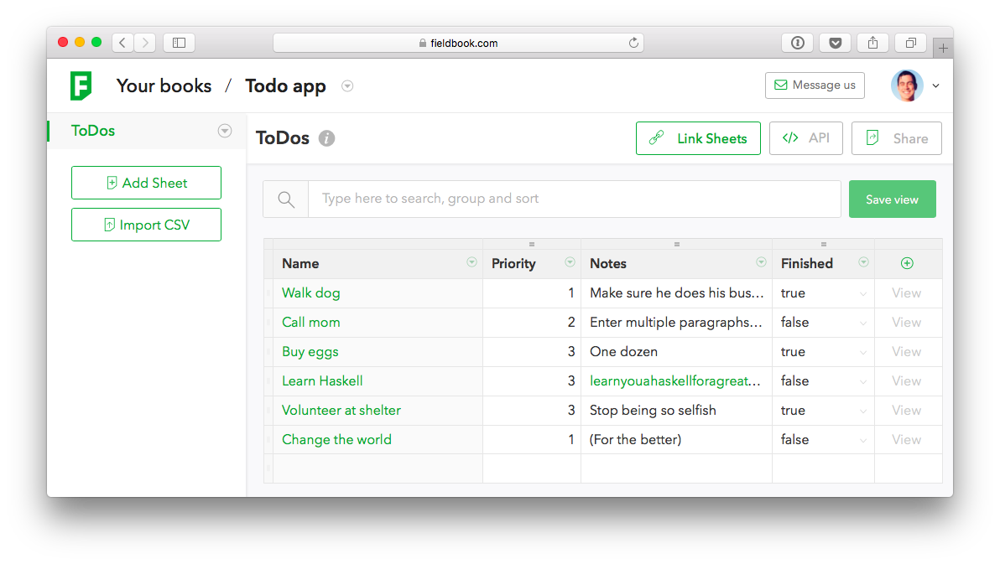

# FieldBook Client for .NET

First, add the `fieldbook-sharp` NuGet to your app.

### Step 1: Create a Book and a Sheet

Visit [fieldbook.com](http://fieldbook.com) to create a free account and make your first book.
Make a `ToDos` sheet that looks like this:



### Step 2: Create a class to represent ToDos

```csharp
class ToDo : FieldBook.IRow
{
    // Required for IRow
    public int Id { get; set; }
    
    public string Name { get; set; }
    public string Notes { get; set; }
    public int Priority { get; set; }
    public bool Finished { get; set; }
}
```

### Step 3: Create your book and sheet objects

Click `Manage API access` inside of FieldBook to get your book ID and create an API key.
Then make a `Book`, and use the book to get a strongly typed reference to the sheet:

```csharp
var book = new Book("book id", "api key name", "api key");
var sheet = book.GetSheet<ToDo>();
```

### Step 4: Use the sheet to query, create, update, and delete

```csharp
// List all todos
List<ToDo> allTodos = await sheet.List();

// Or just list some
var someTodos = await sheet.List(offset: 5, limit: 25);

// Get todo by Id
ToDo todo = await sheet.Get(0);

// Or get a todo this hipster way via indexer
var hipsterTodo = await sheet[42];

// Change a todo
todo.Priority = 10;
await sheet.Update(todo);

// Or update just some fields for more efficiency
await sheet.Update(todo, new { Priority = todo.Priority });

// Delete a todo
await sheet.Delete(todo);

// Create a todo
await sheet.Create(new ToDo
{
    Priority = 1,
    Name = "Build an app",
    Description = "Awesomely with Xamarin",
});
```
